# Agent Workflow TUI status

> Generated deterministically from task front matter. Do not edit this file directly.
> Status records coordination progress; it is not evidence that product behavior is accepted.

## Portfolio overview

**88 ARs tracked** across 3 active status categories.

| Status | Meaning | Count |
| --- | --- | ---: |
| **In progress** | Claimed work with a live lease | 2 |
| **Open** | Dependency-ready and available to claim | 0 |
| **Blocked** | Cannot proceed until its recorded blocker clears | 0 |
| **Planned** | Defined work awaiting promotion or dependencies | 2 |
| **Future** | Deferred roadmap work | 0 |
| **Done** | Accepted, integrated, and durably verified | 84 |
| **Cancelled** | Stopped with a recorded rationale | 0 |
| **Superseded** | Replaced by another AR | 0 |

## Dependency graph

Arrows point from each prerequisite to the work that depends on it. Color is redundant
with the status text inside every node; the tables below are the complete text
alternative.

```mermaid
flowchart LR
    subgraph series_00["00 - Coordination foundation"]
        direction TB
        AR_0001["AR-0001 - Done"]:::status_done
        AR_0002["AR-0002 - Done"]:::status_done
        AR_0003["AR-0003 - Done"]:::status_done
        AR_0004["AR-0004 - Done"]:::status_done
        AR_0005["AR-0005 - Done"]:::status_done
        AR_0006["AR-0006 - Done"]:::status_done
        AR_0007["AR-0007 - Done"]:::status_done
        AR_0008["AR-0008 - Done"]:::status_done
        AR_0009["AR-0009 - Done"]:::status_done
        AR_0010["AR-0010 - Done"]:::status_done
        AR_0011["AR-0011 - Done"]:::status_done
        AR_0012["AR-0012 - Done"]:::status_done
        AR_0013["AR-0013 - Done"]:::status_done
        AR_0014["AR-0014 - Done"]:::status_done
        AR_0015["AR-0015 - Done"]:::status_done
        AR_0016["AR-0016 - Done"]:::status_done
        AR_0017["AR-0017 - Done"]:::status_done
        AR_0018["AR-0018 - Done"]:::status_done
        AR_0019["AR-0019 - Done"]:::status_done
        AR_0020["AR-0020 - Done"]:::status_done
        AR_0021["AR-0021 - Done"]:::status_done
        AR_0022["AR-0022 - Done"]:::status_done
        AR_0023["AR-0023 - Done"]:::status_done
        AR_0024["AR-0024 - Done"]:::status_done
        AR_0025["AR-0025 - Done"]:::status_done
        AR_0026["AR-0026 - Done"]:::status_done
        AR_0027["AR-0027 - Done"]:::status_done
        AR_0028["AR-0028 - Done"]:::status_done
        AR_0029["AR-0029 - Done"]:::status_done
        AR_0030["AR-0030 - Done"]:::status_done
        AR_0031["AR-0031 - Done"]:::status_done
        AR_0032["AR-0032 - Done"]:::status_done
        AR_0033["AR-0033 - Done"]:::status_done
        AR_0034["AR-0034 - Done"]:::status_done
        AR_0035["AR-0035 - Done"]:::status_done
        AR_0036["AR-0036 - Done"]:::status_done
        AR_0037["AR-0037 - Done"]:::status_done
        AR_0038["AR-0038 - Done"]:::status_done
        AR_0039["AR-0039 - Done"]:::status_done
        AR_0040["AR-0040 - Done"]:::status_done
        AR_0041["AR-0041 - Done"]:::status_done
        AR_0042["AR-0042 - Done"]:::status_done
        AR_0043["AR-0043 - Done"]:::status_done
        AR_0044["AR-0044 - Done"]:::status_done
        AR_0045["AR-0045 - Done"]:::status_done
        AR_0046["AR-0046 - Done"]:::status_done
        AR_0047["AR-0047 - Done"]:::status_done
        AR_0048["AR-0048 - Done"]:::status_done
        AR_0049["AR-0049 - Done"]:::status_done
        AR_0050["AR-0050 - Done"]:::status_done
        AR_0051["AR-0051 - Done"]:::status_done
        AR_0052["AR-0052 - Done"]:::status_done
        AR_0053["AR-0053 - Done"]:::status_done
        AR_0054["AR-0054 - Done"]:::status_done
        AR_0055["AR-0055 - Done"]:::status_done
        AR_0056["AR-0056 - Done"]:::status_done
        AR_0057["AR-0057 - Done"]:::status_done
        AR_0058["AR-0058 - Done"]:::status_done
        AR_0059["AR-0059 - Done"]:::status_done
        AR_0060["AR-0060 - Done"]:::status_done
        AR_0061["AR-0061 - Done"]:::status_done
        AR_0062["AR-0062 - Done"]:::status_done
        AR_0063["AR-0063 - Done"]:::status_done
        AR_0064["AR-0064 - Done"]:::status_done
        AR_0065["AR-0065 - Done"]:::status_done
        AR_0066["AR-0066 - Done"]:::status_done
        AR_0067["AR-0067 - Done"]:::status_done
        AR_0068["AR-0068 - Done"]:::status_done
        AR_0069["AR-0069 - Done"]:::status_done
        AR_0070["AR-0070 - Done"]:::status_done
        AR_0071["AR-0071 - Done"]:::status_done
        AR_0072["AR-0072 - Done"]:::status_done
        AR_0073["AR-0073 - Done"]:::status_done
        AR_0074["AR-0074 - Done"]:::status_done
        AR_0075["AR-0075 - Done"]:::status_done
        AR_0076["AR-0076 - Done"]:::status_done
        AR_0077["AR-0077 - Done"]:::status_done
        AR_0078["AR-0078 - Done"]:::status_done
        AR_0079["AR-0079 - Done"]:::status_done
        AR_0080["AR-0080 - Done"]:::status_done
        AR_0081["AR-0081 - Done"]:::status_done
        AR_0082["AR-0082 - Done"]:::status_done
        AR_0083["AR-0083 - In progress"]:::status_in_progress
        AR_0084["AR-0084 - Planned"]:::status_planned
        AR_0085["AR-0085 - In progress"]:::status_in_progress
        AR_0086["AR-0086 - Done"]:::status_done
        AR_0087["AR-0087 - Done"]:::status_done
        AR_0088["AR-0088 - Planned"]:::status_planned
    end
    AR_0001 --> AR_0002
    AR_0001 --> AR_0003
    AR_0001 --> AR_0014
    AR_0001 --> AR_0015
    AR_0002 --> AR_0004
    AR_0002 --> AR_0018
    AR_0003 --> AR_0004
    AR_0003 --> AR_0008
    AR_0003 --> AR_0010
    AR_0004 --> AR_0005
    AR_0004 --> AR_0009
    AR_0004 --> AR_0018
    AR_0004 --> AR_0019
    AR_0005 --> AR_0006
    AR_0005 --> AR_0009
    AR_0005 --> AR_0020
    AR_0005 --> AR_0021
    AR_0006 --> AR_0007
    AR_0006 --> AR_0008
    AR_0006 --> AR_0010
    AR_0006 --> AR_0022
    AR_0007 --> AR_0009
    AR_0007 --> AR_0011
    AR_0007 --> AR_0023
    AR_0008 --> AR_0011
    AR_0008 --> AR_0027
    AR_0009 --> AR_0011
    AR_0009 --> AR_0027
    AR_0010 --> AR_0011
    AR_0010 --> AR_0027
    AR_0011 --> AR_0016
    AR_0011 --> AR_0017
    AR_0012 --> AR_0013
    AR_0013 --> AR_0029
    AR_0014 --> AR_0002
    AR_0014 --> AR_0015
    AR_0015 --> AR_0003
    AR_0016 --> AR_0012
    AR_0017 --> AR_0012
    AR_0018 --> AR_0019
    AR_0018 --> AR_0020
    AR_0018 --> AR_0021
    AR_0018 --> AR_0022
    AR_0018 --> AR_0023
    AR_0018 --> AR_0026
    AR_0018 --> AR_0038
    AR_0019 --> AR_0020
    AR_0019 --> AR_0024
    AR_0019 --> AR_0038
    AR_0020 --> AR_0024
    AR_0020 --> AR_0027
    AR_0020 --> AR_0039
    AR_0021 --> AR_0039
    AR_0024 --> AR_0039
    AR_0026 --> AR_0040
    AR_0027 --> AR_0025
    AR_0027 --> AR_0028
    AR_0028 --> AR_0025
    AR_0029 --> AR_0030
    AR_0030 --> AR_0031
    AR_0030 --> AR_0032
    AR_0030 --> AR_0034
    AR_0030 --> AR_0035
    AR_0031 --> AR_0033
    AR_0032 --> AR_0034
    AR_0033 --> AR_0035
    AR_0033 --> AR_0036
    AR_0034 --> AR_0037
    AR_0038 --> AR_0040
    AR_0038 --> AR_0041
    AR_0038 --> AR_0044
    AR_0039 --> AR_0041
    AR_0040 --> AR_0041
    AR_0041 --> AR_0042
    AR_0041 --> AR_0043
    AR_0041 --> AR_0044
    AR_0042 --> AR_0043
    AR_0044 --> AR_0045
    AR_0045 --> AR_0046
    AR_0046 --> AR_0047
    AR_0047 --> AR_0048
    AR_0048 --> AR_0049
    AR_0049 --> AR_0050
    AR_0050 --> AR_0051
    AR_0051 --> AR_0052
    AR_0052 --> AR_0053
    AR_0053 --> AR_0054
    AR_0053 --> AR_0056
    AR_0053 --> AR_0078
    AR_0054 --> AR_0055
    AR_0054 --> AR_0060
    AR_0055 --> AR_0057
    AR_0055 --> AR_0058
    AR_0055 --> AR_0068
    AR_0056 --> AR_0057
    AR_0056 --> AR_0059
    AR_0056 --> AR_0068
    AR_0057 --> AR_0061
    AR_0058 --> AR_0057
    AR_0058 --> AR_0059
    AR_0058 --> AR_0060
    AR_0058 --> AR_0068
    AR_0059 --> AR_0061
    AR_0059 --> AR_0063
    AR_0059 --> AR_0065
    AR_0059 --> AR_0068
    AR_0060 --> AR_0061
    AR_0060 --> AR_0062
    AR_0061 --> AR_0065
    AR_0062 --> AR_0063
    AR_0063 --> AR_0064
    AR_0063 --> AR_0065
    AR_0064 --> AR_0066
    AR_0064 --> AR_0067
    AR_0065 --> AR_0066
    AR_0065 --> AR_0067
    AR_0065 --> AR_0068
    AR_0065 --> AR_0079
    AR_0067 --> AR_0069
    AR_0067 --> AR_0070
    AR_0068 --> AR_0069
    AR_0068 --> AR_0070
    AR_0068 --> AR_0071
    AR_0068 --> AR_0080
    AR_0069 --> AR_0070
    AR_0069 --> AR_0071
    AR_0069 --> AR_0081
    AR_0070 --> AR_0071
    AR_0070 --> AR_0078
    AR_0071 --> AR_0072
    AR_0072 --> AR_0073
    AR_0073 --> AR_0074
    AR_0073 --> AR_0075
    AR_0073 --> AR_0076
    AR_0073 --> AR_0078
    AR_0074 --> AR_0075
    AR_0074 --> AR_0076
    AR_0074 --> AR_0080
    AR_0075 --> AR_0076
    AR_0075 --> AR_0077
    AR_0075 --> AR_0079
    AR_0076 --> AR_0077
    AR_0077 --> AR_0080
    AR_0078 --> AR_0079
    AR_0078 --> AR_0082
    AR_0079 --> AR_0080
    AR_0079 --> AR_0081
    AR_0079 --> AR_0082
    AR_0080 --> AR_0081
    AR_0080 --> AR_0082
    AR_0081 --> AR_0082
    AR_0083 --> AR_0084
    AR_0083 --> AR_0088
    AR_0084 --> AR_0088
    AR_0085 --> AR_0088
    AR_0086 --> AR_0088
    AR_0087 --> AR_0088
    classDef status_in_progress fill:#1565c0,color:#ffffff,stroke:#263238,stroke-width:2px
    classDef status_open fill:#2e7d32,color:#ffffff,stroke:#263238,stroke-width:2px
    classDef status_blocked fill:#c62828,color:#ffffff,stroke:#263238,stroke-width:2px
    classDef status_planned fill:#6a1b9a,color:#ffffff,stroke:#263238,stroke-width:2px
    classDef status_future fill:#455a64,color:#ffffff,stroke:#263238,stroke-width:2px
    classDef status_done fill:#00695c,color:#ffffff,stroke:#263238,stroke-width:2px
    classDef status_cancelled fill:#616161,color:#ffffff,stroke:#263238,stroke-width:2px
    classDef status_superseded fill:#5d4037,color:#ffffff,stroke:#263238,stroke-width:2px
```

### Accessible dependency index

| AR | Prerequisites | Dependents |
| --- | --- | --- |
| [AR-0001](tasks/AR-0001.md) | None | [AR-0002](tasks/AR-0002.md), [AR-0003](tasks/AR-0003.md), [AR-0014](tasks/AR-0014.md), [AR-0015](tasks/AR-0015.md) |
| [AR-0002](tasks/AR-0002.md) | [AR-0001](tasks/AR-0001.md), [AR-0014](tasks/AR-0014.md) | [AR-0004](tasks/AR-0004.md), [AR-0018](tasks/AR-0018.md) |
| [AR-0003](tasks/AR-0003.md) | [AR-0001](tasks/AR-0001.md), [AR-0015](tasks/AR-0015.md) | [AR-0004](tasks/AR-0004.md), [AR-0008](tasks/AR-0008.md), [AR-0010](tasks/AR-0010.md) |
| [AR-0004](tasks/AR-0004.md) | [AR-0002](tasks/AR-0002.md), [AR-0003](tasks/AR-0003.md) | [AR-0005](tasks/AR-0005.md), [AR-0009](tasks/AR-0009.md), [AR-0018](tasks/AR-0018.md), [AR-0019](tasks/AR-0019.md) |
| [AR-0005](tasks/AR-0005.md) | [AR-0004](tasks/AR-0004.md) | [AR-0006](tasks/AR-0006.md), [AR-0009](tasks/AR-0009.md), [AR-0020](tasks/AR-0020.md), [AR-0021](tasks/AR-0021.md) |
| [AR-0006](tasks/AR-0006.md) | [AR-0005](tasks/AR-0005.md) | [AR-0007](tasks/AR-0007.md), [AR-0008](tasks/AR-0008.md), [AR-0010](tasks/AR-0010.md), [AR-0022](tasks/AR-0022.md) |
| [AR-0007](tasks/AR-0007.md) | [AR-0006](tasks/AR-0006.md) | [AR-0009](tasks/AR-0009.md), [AR-0011](tasks/AR-0011.md), [AR-0023](tasks/AR-0023.md) |
| [AR-0008](tasks/AR-0008.md) | [AR-0003](tasks/AR-0003.md), [AR-0006](tasks/AR-0006.md) | [AR-0011](tasks/AR-0011.md), [AR-0027](tasks/AR-0027.md) |
| [AR-0009](tasks/AR-0009.md) | [AR-0004](tasks/AR-0004.md), [AR-0005](tasks/AR-0005.md), [AR-0007](tasks/AR-0007.md) | [AR-0011](tasks/AR-0011.md), [AR-0027](tasks/AR-0027.md) |
| [AR-0010](tasks/AR-0010.md) | [AR-0003](tasks/AR-0003.md), [AR-0006](tasks/AR-0006.md) | [AR-0011](tasks/AR-0011.md), [AR-0027](tasks/AR-0027.md) |
| [AR-0011](tasks/AR-0011.md) | [AR-0007](tasks/AR-0007.md), [AR-0008](tasks/AR-0008.md), [AR-0009](tasks/AR-0009.md), [AR-0010](tasks/AR-0010.md) | [AR-0016](tasks/AR-0016.md), [AR-0017](tasks/AR-0017.md) |
| [AR-0012](tasks/AR-0012.md) | [AR-0016](tasks/AR-0016.md), [AR-0017](tasks/AR-0017.md) | [AR-0013](tasks/AR-0013.md) |
| [AR-0013](tasks/AR-0013.md) | [AR-0012](tasks/AR-0012.md) | [AR-0029](tasks/AR-0029.md) |
| [AR-0014](tasks/AR-0014.md) | [AR-0001](tasks/AR-0001.md) | [AR-0002](tasks/AR-0002.md), [AR-0015](tasks/AR-0015.md) |
| [AR-0015](tasks/AR-0015.md) | [AR-0001](tasks/AR-0001.md), [AR-0014](tasks/AR-0014.md) | [AR-0003](tasks/AR-0003.md) |
| [AR-0016](tasks/AR-0016.md) | [AR-0011](tasks/AR-0011.md) | [AR-0012](tasks/AR-0012.md) |
| [AR-0017](tasks/AR-0017.md) | [AR-0011](tasks/AR-0011.md) | [AR-0012](tasks/AR-0012.md) |
| [AR-0018](tasks/AR-0018.md) | [AR-0002](tasks/AR-0002.md), [AR-0004](tasks/AR-0004.md) | [AR-0019](tasks/AR-0019.md), [AR-0020](tasks/AR-0020.md), [AR-0021](tasks/AR-0021.md), [AR-0022](tasks/AR-0022.md), [AR-0023](tasks/AR-0023.md), [AR-0026](tasks/AR-0026.md), [AR-0038](tasks/AR-0038.md) |
| [AR-0019](tasks/AR-0019.md) | [AR-0004](tasks/AR-0004.md), [AR-0018](tasks/AR-0018.md) | [AR-0020](tasks/AR-0020.md), [AR-0024](tasks/AR-0024.md), [AR-0038](tasks/AR-0038.md) |
| [AR-0020](tasks/AR-0020.md) | [AR-0005](tasks/AR-0005.md), [AR-0018](tasks/AR-0018.md), [AR-0019](tasks/AR-0019.md) | [AR-0024](tasks/AR-0024.md), [AR-0027](tasks/AR-0027.md), [AR-0039](tasks/AR-0039.md) |
| [AR-0021](tasks/AR-0021.md) | [AR-0005](tasks/AR-0005.md), [AR-0018](tasks/AR-0018.md) | [AR-0039](tasks/AR-0039.md) |
| [AR-0022](tasks/AR-0022.md) | [AR-0006](tasks/AR-0006.md), [AR-0018](tasks/AR-0018.md) | None |
| [AR-0023](tasks/AR-0023.md) | [AR-0007](tasks/AR-0007.md), [AR-0018](tasks/AR-0018.md) | None |
| [AR-0024](tasks/AR-0024.md) | [AR-0019](tasks/AR-0019.md), [AR-0020](tasks/AR-0020.md) | [AR-0039](tasks/AR-0039.md) |
| [AR-0025](tasks/AR-0025.md) | [AR-0027](tasks/AR-0027.md), [AR-0028](tasks/AR-0028.md) | None |
| [AR-0026](tasks/AR-0026.md) | [AR-0018](tasks/AR-0018.md) | [AR-0040](tasks/AR-0040.md) |
| [AR-0027](tasks/AR-0027.md) | [AR-0008](tasks/AR-0008.md), [AR-0009](tasks/AR-0009.md), [AR-0010](tasks/AR-0010.md), [AR-0020](tasks/AR-0020.md) | [AR-0025](tasks/AR-0025.md), [AR-0028](tasks/AR-0028.md) |
| [AR-0028](tasks/AR-0028.md) | [AR-0027](tasks/AR-0027.md) | [AR-0025](tasks/AR-0025.md) |
| [AR-0029](tasks/AR-0029.md) | [AR-0013](tasks/AR-0013.md) | [AR-0030](tasks/AR-0030.md) |
| [AR-0030](tasks/AR-0030.md) | [AR-0029](tasks/AR-0029.md) | [AR-0031](tasks/AR-0031.md), [AR-0032](tasks/AR-0032.md), [AR-0034](tasks/AR-0034.md), [AR-0035](tasks/AR-0035.md) |
| [AR-0031](tasks/AR-0031.md) | [AR-0030](tasks/AR-0030.md) | [AR-0033](tasks/AR-0033.md) |
| [AR-0032](tasks/AR-0032.md) | [AR-0030](tasks/AR-0030.md) | [AR-0034](tasks/AR-0034.md) |
| [AR-0033](tasks/AR-0033.md) | [AR-0031](tasks/AR-0031.md) | [AR-0035](tasks/AR-0035.md), [AR-0036](tasks/AR-0036.md) |
| [AR-0034](tasks/AR-0034.md) | [AR-0030](tasks/AR-0030.md), [AR-0032](tasks/AR-0032.md) | [AR-0037](tasks/AR-0037.md) |
| [AR-0035](tasks/AR-0035.md) | [AR-0030](tasks/AR-0030.md), [AR-0033](tasks/AR-0033.md) | None |
| [AR-0036](tasks/AR-0036.md) | [AR-0033](tasks/AR-0033.md) | None |
| [AR-0037](tasks/AR-0037.md) | [AR-0034](tasks/AR-0034.md) | None |
| [AR-0038](tasks/AR-0038.md) | [AR-0018](tasks/AR-0018.md), [AR-0019](tasks/AR-0019.md) | [AR-0040](tasks/AR-0040.md), [AR-0041](tasks/AR-0041.md), [AR-0044](tasks/AR-0044.md) |
| [AR-0039](tasks/AR-0039.md) | [AR-0020](tasks/AR-0020.md), [AR-0021](tasks/AR-0021.md), [AR-0024](tasks/AR-0024.md) | [AR-0041](tasks/AR-0041.md) |
| [AR-0040](tasks/AR-0040.md) | [AR-0026](tasks/AR-0026.md), [AR-0038](tasks/AR-0038.md) | [AR-0041](tasks/AR-0041.md) |
| [AR-0041](tasks/AR-0041.md) | [AR-0038](tasks/AR-0038.md), [AR-0039](tasks/AR-0039.md), [AR-0040](tasks/AR-0040.md) | [AR-0042](tasks/AR-0042.md), [AR-0043](tasks/AR-0043.md), [AR-0044](tasks/AR-0044.md) |
| [AR-0042](tasks/AR-0042.md) | [AR-0041](tasks/AR-0041.md) | [AR-0043](tasks/AR-0043.md) |
| [AR-0043](tasks/AR-0043.md) | [AR-0041](tasks/AR-0041.md), [AR-0042](tasks/AR-0042.md) | None |
| [AR-0044](tasks/AR-0044.md) | [AR-0038](tasks/AR-0038.md), [AR-0041](tasks/AR-0041.md) | [AR-0045](tasks/AR-0045.md) |
| [AR-0045](tasks/AR-0045.md) | [AR-0044](tasks/AR-0044.md) | [AR-0046](tasks/AR-0046.md) |
| [AR-0046](tasks/AR-0046.md) | [AR-0045](tasks/AR-0045.md) | [AR-0047](tasks/AR-0047.md) |
| [AR-0047](tasks/AR-0047.md) | [AR-0046](tasks/AR-0046.md) | [AR-0048](tasks/AR-0048.md) |
| [AR-0048](tasks/AR-0048.md) | [AR-0047](tasks/AR-0047.md) | [AR-0049](tasks/AR-0049.md) |
| [AR-0049](tasks/AR-0049.md) | [AR-0048](tasks/AR-0048.md) | [AR-0050](tasks/AR-0050.md) |
| [AR-0050](tasks/AR-0050.md) | [AR-0049](tasks/AR-0049.md) | [AR-0051](tasks/AR-0051.md) |
| [AR-0051](tasks/AR-0051.md) | [AR-0050](tasks/AR-0050.md) | [AR-0052](tasks/AR-0052.md) |
| [AR-0052](tasks/AR-0052.md) | [AR-0051](tasks/AR-0051.md) | [AR-0053](tasks/AR-0053.md) |
| [AR-0053](tasks/AR-0053.md) | [AR-0052](tasks/AR-0052.md) | [AR-0054](tasks/AR-0054.md), [AR-0056](tasks/AR-0056.md), [AR-0078](tasks/AR-0078.md) |
| [AR-0054](tasks/AR-0054.md) | [AR-0053](tasks/AR-0053.md) | [AR-0055](tasks/AR-0055.md), [AR-0060](tasks/AR-0060.md) |
| [AR-0055](tasks/AR-0055.md) | [AR-0054](tasks/AR-0054.md) | [AR-0057](tasks/AR-0057.md), [AR-0058](tasks/AR-0058.md), [AR-0068](tasks/AR-0068.md) |
| [AR-0056](tasks/AR-0056.md) | [AR-0053](tasks/AR-0053.md) | [AR-0057](tasks/AR-0057.md), [AR-0059](tasks/AR-0059.md), [AR-0068](tasks/AR-0068.md) |
| [AR-0057](tasks/AR-0057.md) | [AR-0055](tasks/AR-0055.md), [AR-0056](tasks/AR-0056.md), [AR-0058](tasks/AR-0058.md) | [AR-0061](tasks/AR-0061.md) |
| [AR-0058](tasks/AR-0058.md) | [AR-0055](tasks/AR-0055.md) | [AR-0057](tasks/AR-0057.md), [AR-0059](tasks/AR-0059.md), [AR-0060](tasks/AR-0060.md), [AR-0068](tasks/AR-0068.md) |
| [AR-0059](tasks/AR-0059.md) | [AR-0056](tasks/AR-0056.md), [AR-0058](tasks/AR-0058.md) | [AR-0061](tasks/AR-0061.md), [AR-0063](tasks/AR-0063.md), [AR-0065](tasks/AR-0065.md), [AR-0068](tasks/AR-0068.md) |
| [AR-0060](tasks/AR-0060.md) | [AR-0054](tasks/AR-0054.md), [AR-0058](tasks/AR-0058.md) | [AR-0061](tasks/AR-0061.md), [AR-0062](tasks/AR-0062.md) |
| [AR-0061](tasks/AR-0061.md) | [AR-0057](tasks/AR-0057.md), [AR-0059](tasks/AR-0059.md), [AR-0060](tasks/AR-0060.md) | [AR-0065](tasks/AR-0065.md) |
| [AR-0062](tasks/AR-0062.md) | [AR-0060](tasks/AR-0060.md) | [AR-0063](tasks/AR-0063.md) |
| [AR-0063](tasks/AR-0063.md) | [AR-0059](tasks/AR-0059.md), [AR-0062](tasks/AR-0062.md) | [AR-0064](tasks/AR-0064.md), [AR-0065](tasks/AR-0065.md) |
| [AR-0064](tasks/AR-0064.md) | [AR-0063](tasks/AR-0063.md) | [AR-0066](tasks/AR-0066.md), [AR-0067](tasks/AR-0067.md) |
| [AR-0065](tasks/AR-0065.md) | [AR-0059](tasks/AR-0059.md), [AR-0061](tasks/AR-0061.md), [AR-0063](tasks/AR-0063.md) | [AR-0066](tasks/AR-0066.md), [AR-0067](tasks/AR-0067.md), [AR-0068](tasks/AR-0068.md), [AR-0079](tasks/AR-0079.md) |
| [AR-0066](tasks/AR-0066.md) | [AR-0064](tasks/AR-0064.md), [AR-0065](tasks/AR-0065.md) | None |
| [AR-0067](tasks/AR-0067.md) | [AR-0064](tasks/AR-0064.md), [AR-0065](tasks/AR-0065.md) | [AR-0069](tasks/AR-0069.md), [AR-0070](tasks/AR-0070.md) |
| [AR-0068](tasks/AR-0068.md) | [AR-0055](tasks/AR-0055.md), [AR-0056](tasks/AR-0056.md), [AR-0058](tasks/AR-0058.md), [AR-0059](tasks/AR-0059.md), [AR-0065](tasks/AR-0065.md) | [AR-0069](tasks/AR-0069.md), [AR-0070](tasks/AR-0070.md), [AR-0071](tasks/AR-0071.md), [AR-0080](tasks/AR-0080.md) |
| [AR-0069](tasks/AR-0069.md) | [AR-0067](tasks/AR-0067.md), [AR-0068](tasks/AR-0068.md) | [AR-0070](tasks/AR-0070.md), [AR-0071](tasks/AR-0071.md), [AR-0081](tasks/AR-0081.md) |
| [AR-0070](tasks/AR-0070.md) | [AR-0067](tasks/AR-0067.md), [AR-0068](tasks/AR-0068.md), [AR-0069](tasks/AR-0069.md) | [AR-0071](tasks/AR-0071.md), [AR-0078](tasks/AR-0078.md) |
| [AR-0071](tasks/AR-0071.md) | [AR-0068](tasks/AR-0068.md), [AR-0069](tasks/AR-0069.md), [AR-0070](tasks/AR-0070.md) | [AR-0072](tasks/AR-0072.md) |
| [AR-0072](tasks/AR-0072.md) | [AR-0071](tasks/AR-0071.md) | [AR-0073](tasks/AR-0073.md) |
| [AR-0073](tasks/AR-0073.md) | [AR-0072](tasks/AR-0072.md) | [AR-0074](tasks/AR-0074.md), [AR-0075](tasks/AR-0075.md), [AR-0076](tasks/AR-0076.md), [AR-0078](tasks/AR-0078.md) |
| [AR-0074](tasks/AR-0074.md) | [AR-0073](tasks/AR-0073.md) | [AR-0075](tasks/AR-0075.md), [AR-0076](tasks/AR-0076.md), [AR-0080](tasks/AR-0080.md) |
| [AR-0075](tasks/AR-0075.md) | [AR-0073](tasks/AR-0073.md), [AR-0074](tasks/AR-0074.md) | [AR-0076](tasks/AR-0076.md), [AR-0077](tasks/AR-0077.md), [AR-0079](tasks/AR-0079.md) |
| [AR-0076](tasks/AR-0076.md) | [AR-0073](tasks/AR-0073.md), [AR-0074](tasks/AR-0074.md), [AR-0075](tasks/AR-0075.md) | [AR-0077](tasks/AR-0077.md) |
| [AR-0077](tasks/AR-0077.md) | [AR-0075](tasks/AR-0075.md), [AR-0076](tasks/AR-0076.md) | [AR-0080](tasks/AR-0080.md) |
| [AR-0078](tasks/AR-0078.md) | [AR-0053](tasks/AR-0053.md), [AR-0070](tasks/AR-0070.md), [AR-0073](tasks/AR-0073.md) | [AR-0079](tasks/AR-0079.md), [AR-0082](tasks/AR-0082.md) |
| [AR-0079](tasks/AR-0079.md) | [AR-0065](tasks/AR-0065.md), [AR-0075](tasks/AR-0075.md), [AR-0078](tasks/AR-0078.md) | [AR-0080](tasks/AR-0080.md), [AR-0081](tasks/AR-0081.md), [AR-0082](tasks/AR-0082.md) |
| [AR-0080](tasks/AR-0080.md) | [AR-0068](tasks/AR-0068.md), [AR-0074](tasks/AR-0074.md), [AR-0077](tasks/AR-0077.md), [AR-0079](tasks/AR-0079.md) | [AR-0081](tasks/AR-0081.md), [AR-0082](tasks/AR-0082.md) |
| [AR-0081](tasks/AR-0081.md) | [AR-0069](tasks/AR-0069.md), [AR-0079](tasks/AR-0079.md), [AR-0080](tasks/AR-0080.md) | [AR-0082](tasks/AR-0082.md) |
| [AR-0082](tasks/AR-0082.md) | [AR-0078](tasks/AR-0078.md), [AR-0079](tasks/AR-0079.md), [AR-0080](tasks/AR-0080.md), [AR-0081](tasks/AR-0081.md) | None |
| [AR-0083](tasks/AR-0083.md) | None | [AR-0084](tasks/AR-0084.md), [AR-0088](tasks/AR-0088.md) |
| [AR-0084](tasks/AR-0084.md) | [AR-0083](tasks/AR-0083.md) | [AR-0088](tasks/AR-0088.md) |
| [AR-0085](tasks/AR-0085.md) | None | [AR-0088](tasks/AR-0088.md) |
| [AR-0086](tasks/AR-0086.md) | None | [AR-0088](tasks/AR-0088.md) |
| [AR-0087](tasks/AR-0087.md) | None | [AR-0088](tasks/AR-0088.md) |
| [AR-0088](tasks/AR-0088.md) | [AR-0083](tasks/AR-0083.md), [AR-0084](tasks/AR-0084.md), [AR-0085](tasks/AR-0085.md), [AR-0086](tasks/AR-0086.md), [AR-0087](tasks/AR-0087.md) | None |

## Complete AR inventory

### In progress (2)

| Priority | AR | Owner | Summary | Next action |
| --- | --- | --- | --- | --- |
| P1 | [AR-0083](tasks/AR-0083.md): Company dashboard pane | ui-ar0083-dashboard | Add a board view to awui-live consuming rollup pages via a new board request type in the coordinator TUI bridge, with revision-bound envelopes. | Await PR #112 checks; merge when all checks are green, then reconcile release evidence. |
| P1 | [AR-0085](tasks/AR-0085.md): Directive entry for board instructions | ar0085-directive | Add a board-instruction entry path in the TUI using the revision-bound envelope and decision batch token contract. | Implement the directive entry path and scenario, then open a review PR. |

### Planned (2)

| Priority | AR | Owner | Summary | Next action |
| --- | --- | --- | --- | --- |
| P1 | [AR-0084](tasks/AR-0084.md): Hierarchy drill-down navigation | Unclaimed | Add task-tree navigation (company, role/team, task) with bounded depth, consuming coordinator rollup pages. | Implement hierarchy drill-down and scenarios, then open a review PR. |
| P1 | [AR-0088](tasks/AR-0088.md): Scenario corpus and UX docs update | Unclaimed | Extend scenarios/corpus.json and the UX/requirement-matrix documentation for all new flows. | Extend the scenario corpus and UX docs, then open a review PR. |

### Done (84)

| Priority | AR | Owner | Summary | Next action |
| --- | --- | --- | --- | --- |
| P0 | [AR-0001](tasks/AR-0001.md): TUI bootstrap and ownership review | Unclaimed | Bootstrap TUI ownership and implementation boundary. | Review the TUI project boundary and approve the split lifecycle and envelope contracts. |
| P0 | [AR-0002](tasks/AR-0002.md): Interactive TUI shell | Unclaimed | Build the minimal interactive terminal shell. | Implement only the terminal shell lifecycle and bounded input loop. |
| P0 | [AR-0003](tasks/AR-0003.md): TUI event adapter implementation | Unclaimed | Connect revision-bound envelopes to TUI session boundaries. | Implement adapter transport and predecessor validation on top of the strict envelope schemas. |
| P0 | [AR-0008](tasks/AR-0008.md): Coordinator lifecycle adapter | Unclaimed | Integrate the TUI with Coordinator as AR lifecycle authority. | Bind accepted TUI events to Coordinator task revisions, lifecycle transitions, and durable event references. |
| P0 | [AR-0009](tasks/AR-0009.md): AWG decision adapter | Unclaimed | Integrate TUI interaction with AWG decision semantics. | Consume AWG packet/decision/reconciliation contracts and emit provenance-preserving decision records. |
| P0 | [AR-0010](tasks/AR-0010.md): AWQ quality and evidence adapter | Unclaimed | Integrate quality and evidence gates without turning them into user intent. | Integrate AWQ checks for schema, privacy, formal evidence, rendering, persistence, and truthful limitations. |
| P0 | [AR-0014](tasks/AR-0014.md): Formal TUI lifecycle model | Unclaimed | Define the formal TUI lifecycle state machine. | Formalize the finite AR/TUI lifecycle and fail-closed transitions. |
| P0 | [AR-0015](tasks/AR-0015.md): AR/TUI envelope contract | Unclaimed | Define revision-bound TUI input and output envelopes. | Define strict AR context and TUI event envelope schemas. |
| P0 | [AR-0018](tasks/AR-0018.md): Two-pane navigation and highlighting | Unclaimed | Build the actual two-pane discussion navigation UI. | Implement the two-pane document/discussion-point renderer, navigation, anchors, focus, resize, and unresolved highlighting. |
| P0 | [AR-0025](tasks/AR-0025.md): Live AR/TUI session transport | Unclaimed | Connect the full TUI session to autonomous AR execution. | Integrate completed transport sub-ARs into end-to-end autonomous session orchestration. |
| P0 | [AR-0026](tasks/AR-0026.md): Live TUI toolkit foundation | Unclaimed | Establish the toolkit-backed live TUI foundation. | Select and pin a suitable Python TUI/input toolkit, implement the live application event loop, and provide deterministic headless tests plus fallback behavior. |
| P0 | [AR-0027](tasks/AR-0027.md): Session transport envelopes | Unclaimed | Define live TUI transport identity and acknowledgements. | Implement revision-bound session envelopes, event acknowledgements, and adapter correlation. |
| P0 | [AR-0028](tasks/AR-0028.md): Transport retries and stale rejection | Unclaimed | Make live transport retryable and stale-event safe. | Implement bounded retries and fail-closed handling for stale or rejected events. |
| P0 | [AR-0038](tasks/AR-0038.md): Live document navigation and decision focus | Unclaimed | Make document navigation and decision selection usable live. | Implement real workplan/design document panes, switching, decision selection, and visual highlighting in the live TUI. |
| P0 | [AR-0039](tasks/AR-0039.md): Live proposal and batch interaction | Unclaimed | Make every decision and proposal interaction usable live. | Implement real proposal selection, helper updates, batch decisions, and user-authored proposal input. |
| P0 | [AR-0040](tasks/AR-0040.md): Terminal lifecycle cleanup | Unclaimed | Make live TUI startup and shutdown clean and reversible. | Restore terminal state on every exit path and leave only concise final output. |
| P0 | [AR-0041](tasks/AR-0041.md): Live scenario demo parity | Unclaimed | Prove scenario demos exercise the complete live UI. | Drive representative corpus scenarios through demo packets with multiple decisions and verify clean interactive completion. |
| P0 | [AR-0042](tasks/AR-0042.md): Default live demo and anchor highlighting | Unclaimed | Make the standalone TUI immediately demonstrate the complete interaction model. | Show a multi-decision workplan/design demo by default and visibly mark the active document anchor. |
| P0 | [AR-0043](tasks/AR-0043.md): Live scenario runner parity | Unclaimed | Ensure scenario screenshots exercise the real multi-pane TUI model. | Instantiate the live application model for each scenario replay and include document/decision state in generated demos. |
| P0 | [AR-0044](tasks/AR-0044.md): Markdown document rendering | Unclaimed | Make document panes real Markdown terminal views. | Render Markdown design/workplan documents through a pinned terminal Markdown renderer in the live TUI and demos. |
| P0 | [AR-0046](tasks/AR-0046.md): Anchor-aware document scrolling | Unclaimed | Keep selected decision text visible in the document pane. | Scroll the rendered Markdown document to the selected decision highlight and add PageUp/PageDown navigation. |
| P0 | [AR-0047](tasks/AR-0047.md): Visible revisable decision selections | Unclaimed | Make accepted decision state explicit and revisable in the live TUI. | Render answered decisions with a checkmark and only the selected proposal while permitting replacement before exit. |
| P0 | [AR-0048](tasks/AR-0048.md): Live scenario replay and asciinema documentation | Unclaimed | Make scenario demonstrations real TUI sessions with terminal recordings. | Replay corpus actions through the real prompt-toolkit application and generate human-speed asciinema recordings and documentation links. |
| P0 | [AR-0049](tasks/AR-0049.md): Context-backed live event transport | Unclaimed | Wire real context-backed TUI actions to Coordinator-compatible envelopes. | Route live context actions through the revision-bound transport and expose acknowledgements without changing legacy callbacks. |
| P0 | [AR-0067](tasks/AR-0067.md): GUI batch journal and guarded lifecycle | Unclaimed | Ensure GUI sessions return every revision-bound decision event and cannot silently lose or discard work. | Verify GUI journal semantics during the next UI refresh. |
| P0 | [AR-0070](tasks/AR-0070.md): Canonical live event envelope | Unclaimed | Make every live UI event schema-valid and consumable by the Coordinator bridge. | Verify future protocol extensions against the versioned bridge contract. |
| P0 | [AR-0071](tasks/AR-0071.md): Remote self-bootstrapping UI handoff | Unclaimed | Bootstrap the GUI/TUI decision client from the authoritative SSH host on an unprepared controlling machine. | Verify future launcher releases against the environment-negotiation contract. |
| P0 | [AR-0078](tasks/AR-0078.md): Coordinator-issued dynamic decision tokens | Unclaimed | Generate an authoritative short token dynamically for each complete revision-bound decision batch. | Verify future Coordinator token issuers against the batch-binding and privacy contract. |
| P0 | [AR-0079](tasks/AR-0079.md): Remote token resolution and single-use completion | Unclaimed | Resolve dynamically issued tokens from remote machines and consume them exactly once after durable batch completion. | Verify future remote finalizers against single-use, retry, and replay guarantees. |
| P1 | [AR-0004](tasks/AR-0004.md): Discussion packet presentation | Unclaimed | Present privacy-safe discussion packets in the TUI. | Render AWG discussion packets with ranked alternatives, confidence, implications, and formal evidence. |
| P1 | [AR-0005](tasks/AR-0005.md): Decision and proposal interaction | Unclaimed | Capture explicit oracle decisions and added solutions without cross-point authorization. | Implement per-point selection, rejection, clarification, and evaluated user-authored alternatives. |
| P1 | [AR-0006](tasks/AR-0006.md): Session persistence and recovery | Unclaimed | Persist complete TUI sessions and return durable output to ARs. | Implement atomic session journal, safe exit, resume, re-ask, and bounded future-request mapping. |
| P1 | [AR-0007](tasks/AR-0007.md): Conflict reconciliation and reopen UI | Unclaimed | Provide explicit post-discussion conflict solution and reopen interaction. | Implement conflict/reconciliation views, targeted reopen, contradiction display, and AR continuation events. |
| P1 | [AR-0011](tasks/AR-0011.md): Cross-project integration harness | Unclaimed | Verify cross-project TUI composition and hostile fail-closed traces. | Run deterministic offline composition tests across Coordinator, AWG, and AWQ public contracts. |
| P1 | [AR-0012](tasks/AR-0012.md): Runtime verification orchestration | Unclaimed | Orchestrate runtime verification evidence and AR round trips. | Integrate the recorded-input and recovery runtime evidence into one release-bound report. |
| P1 | [AR-0013](tasks/AR-0013.md): Release and operational qualification | Unclaimed | Publish a reproducible, supported TUI release. | Harden packaging, platform support, accessibility, privacy, signed release, and installation documentation. |
| P1 | [AR-0016](tasks/AR-0016.md): Recorded terminal runtime tests | Unclaimed | Verify normal terminal runtime behavior against public contracts. | Drive the real TUI through recorded terminal input for a complete discussion-to-event round trip. |
| P1 | [AR-0017](tasks/AR-0017.md): Recovery and reopen runtime tests | Unclaimed | Verify runtime recovery and conflict-reopen behavior. | Exercise interrupted save, stale resume, unresolved conflict, targeted reopen, and re-ask runtime paths. |
| P1 | [AR-0019](tasks/AR-0019.md): Proposal and implication helper view | Unclaimed | Render the decision helper view beside the discussion panes. | Implement the helper view for ranked proposals, implications, confidence, trade-offs, evidence gaps, and affected ARs. |
| P1 | [AR-0020](tasks/AR-0020.md): Interactive decision controls | Unclaimed | Connect terminal input to explicit per-point decision and reconciliation events. | Implement keyboard/user-input controls for select, reject, clarify, add proposal, safe exit, and reopen. |
| P1 | [AR-0021](tasks/AR-0021.md): Batched discussion UI | Unclaimed | Implement batched discussion interaction in the terminal UI. | Render batched independent discussion points, coupling warnings, partial responses, and per-point status in the live TUI. |
| P1 | [AR-0022](tasks/AR-0022.md): Journal and continuation UI | Unclaimed | Implement visible persistence and continuation controls. | Expose journal history, safe exit, resume/re-ask, and future-request AR mapping in the live UI. |
| P1 | [AR-0023](tasks/AR-0023.md): Reconciliation and conflict UI | Unclaimed | Implement the live conflict-resolution view and reopen loop. | Render reconciliation diffs, contradiction impact, affected ARs, and targeted reopen/discussion-required actions. |
| P1 | [AR-0024](tasks/AR-0024.md): Anti-rubber-stamp interaction UI | Unclaimed | Make human choice informed, contestable, and authority-explicit. | Implement anti-rubber-stamp framing, authority context, evidence gaps, reject/clarify/more-evidence affordances, and explicit limitations. |
| P1 | [AR-0029](tasks/AR-0029.md): Synthetic TUI scenario corpus | Unclaimed | Define reproducible artificial TUI scenario inputs. | Create a schema-valid synthetic corpus covering diverse TUI interaction workflows. |
| P1 | [AR-0030](tasks/AR-0030.md): Scenario end-to-end runner and screenshots | Unclaimed | Exercise the full TUI interaction surface from synthetic inputs. | Run every corpus scenario through the TUI controls and generate deterministic screenshots. |
| P1 | [AR-0031](tasks/AR-0031.md): Scenario CI freshness gate | Unclaimed | Continuously validate generated TUI workflows in CI. | Add CI jobs that regenerate scenarios/screenshots and fail on stale generated artifacts. |
| P1 | [AR-0032](tasks/AR-0032.md): Generated scenario documentation | Unclaimed | Publish accessible scenario workflows from generated artifacts. | Generate Markdown scenario/workflow documentation linking each input, action trace, and screenshot. |
| P1 | [AR-0033](tasks/AR-0033.md): Control coverage freshness invariant | Unclaimed | Require corpus extension when TUI functionality grows. | Fail scenario validation when a live control lacks corpus coverage. |
| P1 | [AR-0034](tasks/AR-0034.md): Interactive scenario helper script | Unclaimed | Let users run and interact with any generated scenario locally. | Add a zero-argument interactive scenario helper that selects and runs a corpus workflow through the full-screen TUI. |
| P1 | [AR-0035](tasks/AR-0035.md): Deterministic scenario artifact hardening | Unclaimed | Make scenario replay and generated screenshot artifacts fail closed and accessible. | Await PR #35 merge, then run the full product suite and freshness check through handoffctl. |
| P1 | [AR-0036](tasks/AR-0036.md): Rich synthetic scenario inputs | Unclaimed | Strengthen scenario fixtures with complete decision-session use cases and syntax checks. | Add semantically distinct, strongly validated synthetic TUI scenario inputs. |
| P1 | [AR-0037](tasks/AR-0037.md): Interactive helper launcher portability | Unclaimed | Fix direct helper launcher import resolution. | Make the zero-argument helper executable from the repository checkout without package installation. |
| P1 | [AR-0045](tasks/AR-0045.md): Visible active-anchor marker | Unclaimed | Ensure anchor highlighting is visible in the live viewport. | Keep the active Markdown document anchor visible at the top of the document pane. |
| P1 | [AR-0050](tasks/AR-0050.md): Deterministic live recording artifacts | Unclaimed | Prevent renderer timing bytes from making generated recordings flaky. | Canonicalize asciinema frames so repeated CI replay is deterministic while retaining human-paced real-TUI state transitions. |
| P1 | [AR-0051](tasks/AR-0051.md): Fixed pane geometry and responsive resize | Unclaimed | Keep pane geometry stable while supporting terminal resizing. | Give TUI panes explicit bounded dimensions and verify complete full-screen layout behavior across terminal resize events. |
| P1 | [AR-0052](tasks/AR-0052.md): Modal own-proposal editing and guarded exit | Unclaimed | Make own-proposal editing safe, navigable, and reviewable before commit. | Implement the four-field own-proposal form, explicit confirmation, visible progress/saved status, and guarded exit prompt. |
| P1 | [AR-0053](tasks/AR-0053.md): Cross-project TUI request and response contract | Unclaimed | Ensure Guidance, TUI, Coordinator, and Quality share one revision-bound contract. | Wire canonical AWG decision requests and stable candidate identities into TUI inputs and outputs. |
| P1 | [AR-0054](tasks/AR-0054.md): AR structure graph document and highlight projection | Unclaimed | Prevent incorrect document context and highlight selection in live TUI sessions. | Derive Markdown documents and decision highlights from authoritative AR structure graph nodes. |
| P1 | [AR-0055](tasks/AR-0055.md): Windows TUI runtime parity | Unclaimed | Make the live human-in-the-loop TUI usable with supported Windows terminal hosts. | No further action; verify on the next compatibility refresh. |
| P1 | [AR-0056](tasks/AR-0056.md): Remote TUI session transport | Unclaimed | Support remote TUI attachment without weakening Coordinator session and response binding. | No further action; verify transport compatibility on the next bridge refresh. |
| P1 | [AR-0057](tasks/AR-0057.md): Cross-platform TUI CI and compatibility | Unclaimed | Continuously verify synchronized TUI, Coordinator, Guidance, Quality, and transport compatibility. | No further action; compatibility lock is updated by umbrella release PR #23. |
| P1 | [AR-0058](tasks/AR-0058.md): Windows GUI and PySide6 parity | Unclaimed | Provide a supported Windows GUI surface with the same human-in-the-loop decision semantics and packaging guarantees as the TUI. | No further action; verify the optional PySide6 extra on the next Windows GUI refresh. |
| P1 | [AR-0059](tasks/AR-0059.md): Windows PowerShell SSH capability contract | Unclaimed | Make Windows PowerShell SSH invocation and remote-agent capabilities explicit, bounded, and revision-safe. | No further action; validate against the next host-adapter refresh. |
| P1 | [AR-0060](tasks/AR-0060.md): GUI screenshot scenarios and documentation | Unclaimed | Document Windows GUI and terminal workflows with reproducible, privacy-safe visual artifacts. | No further action; verify screenshot artifacts on the next scenario refresh. |
| P1 | [AR-0061](tasks/AR-0061.md): Cross-platform remote-agent round trips | Unclaimed | Verify the complete cross-platform human-in-the-loop path from local UI through SSH to a remote agent and back. | No further action; use a real project host only for optional external qualification. |
| P1 | [AR-0062](tasks/AR-0062.md): Align UI package metadata with the release lock | Unclaimed | Keep installed UI package metadata aligned with the immutable release selected by Agent Workflow. | No further action; verify the immutable v0.4.3 pin on the next compatibility refresh. |
| P1 | [AR-0063](tasks/AR-0063.md): Negotiate remote GUI and TUI capability | Unclaimed | Select the graphical or terminal client explicitly for remote SSH handoffs. | No further action; verify capability negotiation at the next cross-project refresh. |
| P1 | [AR-0064](tasks/AR-0064.md): Professional GUI visual system and interaction help | Unclaimed | Make the desktop decision UI professional, self-explanatory, and comfortable for sustained human review. | Verify the visual system during the next GUI release refresh. |
| P1 | [AR-0065](tasks/AR-0065.md): Single-command cross-platform UI handoff | Unclaimed | Provide one short command that selects GUI/TUI, transfers the request over SSH, and returns the event journal. | Verify the connector against the next cross-project transport refresh. |
| P1 | [AR-0066](tasks/AR-0066.md): GUI UX and handoff documentation | Unclaimed | Document the professional GUI interaction model and the one-command local/remote workflow. | Verify documentation links during the next UI release refresh. |
| P1 | [AR-0068](tasks/AR-0068.md): Portable runtime bootstrap and environment negotiation | Unclaimed | Make the one-command handoff able to provision a temporary compatible UI runtime on the controlling machine. | Verify trusted native ARM archives when available. |
| P1 | [AR-0069](tasks/AR-0069.md): Remote GUI/TUI invocation matrix | Unclaimed | Exercise complete request/UI/result flows across remote Linux, Windows-compatible, and architecture-matrix environments. | Extend to trusted native ARM runners when available. |
| P1 | [AR-0072](tasks/AR-0072.md): Compact remote decision handoff | Unclaimed | Shorten Windows/Linux remote self-bootstrap commands without weakening the decision handoff contract. | Verify future launcher releases against the compact handoff contract. |
| P1 | [AR-0073](tasks/AR-0073.md): Short decision-batch token contract | Unclaimed | Define authoritative short tokens for complete, revision-bound decision batches. | Verify future token-contract releases against the bridge schema. |
| P1 | [AR-0074](tasks/AR-0074.md): One-time awui launcher installation | Unclaimed | Install the awui launcher once so subsequent decision commands are short. | Verify future installer releases against the per-user security and repair contract. |
| P1 | [AR-0075](tasks/AR-0075.md): Tokenized short decision launcher | Unclaimed | Run a complete remote decision batch with a 20–30 character command. | Verify future launcher releases against the tokenized batch and GUI/TUI bridge contract. |
| P1 | [AR-0076](tasks/AR-0076.md): Short-launcher security and compatibility gates | Unclaimed | Prove and document the tokenized short-command decision workflow end to end. | Verify future releases against the short-launcher CI and documentation gates. |
| P1 | [AR-0077](tasks/AR-0077.md): POSIX awui installer and bootstrap parity | Unclaimed | Add the Linux/POSIX one-time awui installer and test all bootstrap paths. | Verify future POSIX installer releases against the bootstrap parity contract. |
| P1 | [AR-0080](tasks/AR-0080.md): Remote-machine installation and environment prerequisites | Unclaimed | Make dynamic-token launch reliable on fresh Windows, Linux, and macOS controlling machines. | Verify future installer releases against fresh-machine routing and capability detection. |
| P1 | [AR-0081](tasks/AR-0081.md): Real-environment dynamic-token qualification | Unclaimed | Qualify Coordinator-issued token sessions across separate machines, platforms, architectures, and failure modes. | Extend the qualification matrix when additional supported architectures or host operating systems are introduced. |
| P1 | [AR-0082](tasks/AR-0082.md): Dynamic-token operator documentation and compatibility release | Unclaimed | Publish the supported dynamic-token workflow and synchronize compatible Agent Workflow releases after qualification. | Verify future releases against the dynamic-token operator and compatibility contract. |
| P1 | [AR-0086](tasks/AR-0086.md): Paused-session card and resume flow | Unclaimed | Render paused sessions in the TUI and resume them through the host transport and handoff contract. | Implement paused-session cards and resume, then open a review PR. |
| P1 | [AR-0087](tasks/AR-0087.md): Rollback and conflict decision display | Unclaimed | Decision packets now render effective windows, rollback ancestry, and conflict reasons with regression coverage. | Verify future checkpoint and conflict displays against the revision-bound packet contract. |
